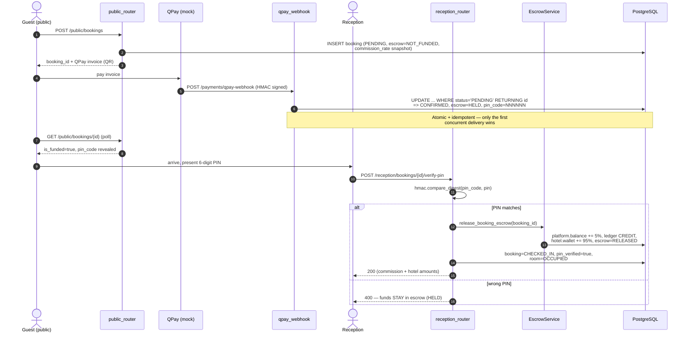
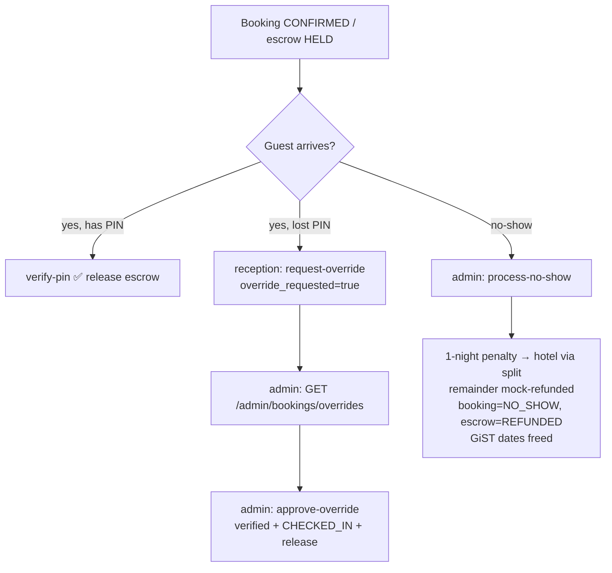
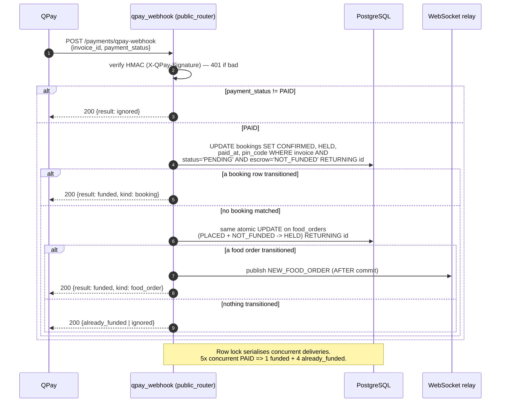
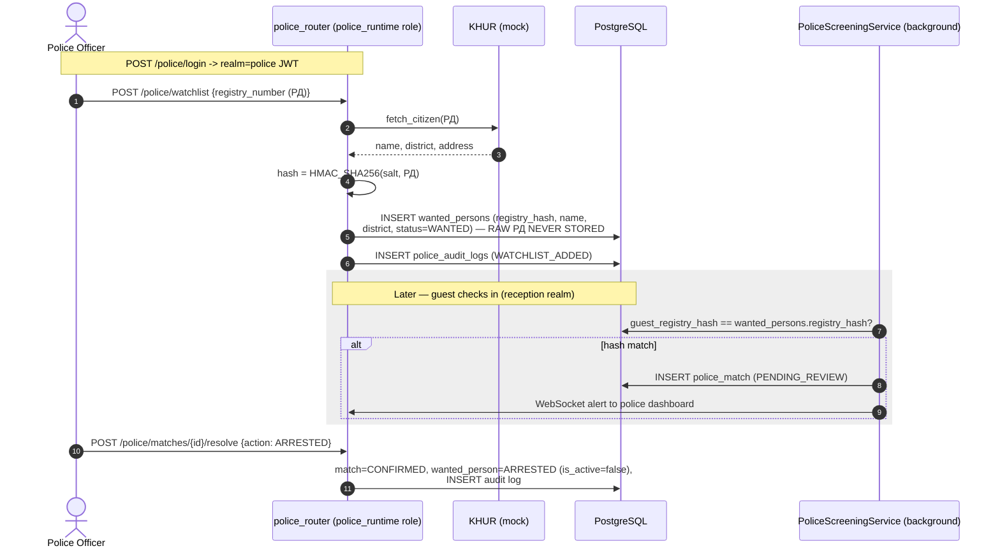
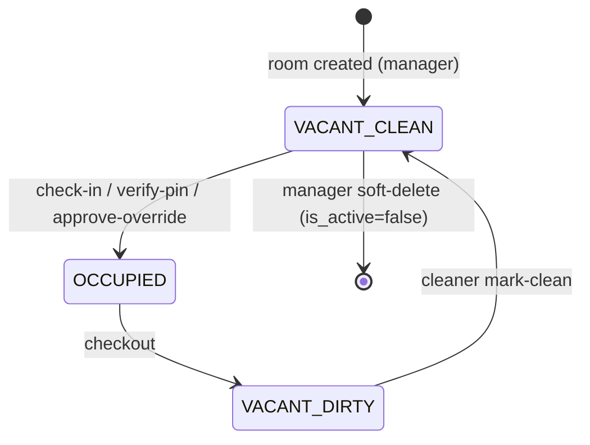

# ZuchiModern — Architecture & Flow Reference

> Deep-dive developer blueprint: business-flow diagrams, function-level DB
> state mapping, and lifecycle state machines. Every DB state change below is
> taken from the actual code (`app/services/payment_escrow_service.py`,
> `app/api/reception_router.py`, `app/api/public_router.py`,
> `app/api/police_router.py`).
>
> Money uses a **snapshot** model: the platform fee is frozen onto each
> payable as `commission_rate = tenant.platform_fee_percent / 100` at creation,
> and the escrow release reads that snapshot — never the tenant's live value.
> Split = `commission = round_half_up(total * commission_rate)`,
> `merchant_share = total - commission`.

---

## 1. System Flowcharts

### Flow 1 — Zero-Trust Booking & Check-in (payment → PIN → escrow release)

**Escalation paths** (when the guest lost the PIN, or never arrived):

### Flow 2 — QPay Payment & Escrow Webhook (atomic funding, HELD)

### Flow 3 — Police Watchlist & KHUR Integration (PII hashing, screening)

Two realms only ever meet through the **salted hash** — neither the hotel nor
the police realm sees the other's raw documents. `app_runtime` has `REVOKE ALL`
on the police tables; the police realm connects with **separate DB
credentials** (`police_runtime`).

---

## 2. Core Function & Service Mapping

### `app/services/payment_escrow_service.py` — `EscrowService`

#### `pay_booking(booking_id, method, idempotency_key)`
- **Purpose:** capture a guest payment into escrow (the sync/mock gateway path;
  the QPay webhook is the async equivalent).
- **DB changes:** `booking.escrow_status NOT_FUNDED → HELD`, `booking.paid_at`
  set. No wallet/ledger movement yet (custody only).
- **Edge cases:** Redis idempotency fence — a replayed key returns the cached
  receipt; a *concurrent* duplicate raises `PaymentInProgressError` (409); a
  fresh key on an already-`HELD` booking raises `InvalidEscrowStateError`.
  Aborts the key on any failure so the client may retry.

#### `release_booking_escrow(booking_id)` → `_release(...)`
- **Purpose:** the **central payout** — settle a HELD booking with the 5/95
  split at the *snapshotted* rate. Called at PIN verify, admin override, or
  checkout.
- **DB changes (one locked transaction, lock order payable → platform →
  merchant):**
  1. lock booking `FOR UPDATE`; require `escrow_status == HELD`
  2. `commission = round_half_up(total_amount * commission_rate)`;
     `booking.commission_amount = commission`
  3. lock `PlatformAccount`; `platform.balance += commission`
  4. `INSERT platform_ledger_entries` (CREDIT, `BOOKING_COMMISSION`,
     `balance_after`) — **append-only, authoritative**
  5. lock `Tenant`; `hotel.wallet_balance += (total - commission)`
  6. `booking.escrow_status → RELEASED`, `escrow_settled_at` set
- **Edge cases:** non-HELD escrow → `InvalidEscrowStateError`; missing
  `PlatformAccount` → `PlatformAccountMissingError`. `release_food_order_escrow`
  is the same path crediting the **restaurant** wallet (`FOOD_ORDER_COMMISSION`).

#### `settle_no_show(booking_id)`
- **Purpose:** settle a paid guest who never arrived — penalty to hotel,
  remainder refunded.
- **DB changes:** require `status == CONFIRMED` **and** `escrow == HELD`. Then:
  - `penalty = min(nightly_rate, total_amount)`; `refund = total - penalty`
  - split the **penalty**: `platform.balance += commission` + ledger CREDIT
    (`note: no-show 1-night penalty`); `hotel.wallet_balance += hotel_share`
  - `booking.commission_amount = commission`
  - `booking.status → NO_SHOW`, `booking.escrow_status → REFUNDED`,
    `escrow_settled_at` set
- **Edge cases:** idempotent by state (second call fails the HELD guard → 409);
  the refund is a **mock** (escrow flips to REFUNDED, amount reported — a real
  PSP reversal slots in here). `NO_SHOW` is excluded from the GiST no-overlap
  constraint, so the dates become bookable again.

#### `settle_minibar_charges(booking_id, method, idempotency_key)`
- **Purpose:** charge unsettled minibar consumptions at checkout and split them
  (5% platform / 95% hotel) in one step (no holding period — goods consumed).
- **DB changes:** lock unsettled `minibar_consumptions`; ledger
  `MINIBAR_COMMISSION` CREDIT; hotel wallet += share; rows → `is_settled=true`.
- **Edge cases:** returns `None` when nothing is owed (frees the idempotency
  key); idempotency-keyed so a retried checkout never double-charges.

#### `generate_arrival_pin()` (module function)
- **Purpose:** CSPRNG 6-digit zero-padded PIN. Called at every **funding**
  point (marketplace confirm, webhook UPDATE, mock simulate-payment) — never
  for walk-ins.

### `app/api/reception_router.py`

#### `verify_pin_check_in(...)` — `POST /reception/bookings/{id}/verify-pin`
- **Purpose:** zero-trust arrival check-in — release escrow only on a proven
  PIN.
- **Guards (in order):** booking exists in caller's hotel (else 404, no
  existence oracle) → `status == CONFIRMED` (else 409) → `pin_code` present
  (else 409) → `room.state == VACANT_CLEAN` (else 409) →
  `hmac.compare_digest(pin_code, pin)` (else **400**, funds stay HELD).
- **DB changes:** `release_booking_escrow()` (see above) then, on the request
  session: `pin_verified=true`, `status → CHECKED_IN`, `room.state → OCCUPIED`;
  optional `registry_number` sets `guest_full_name` + `guest_registry_hash` and
  schedules police screening (post-commit background task).
- **Edge cases:** **retry-safe** — if a prior attempt released escrow but
  crashed before the flip, `InvalidEscrowStateError` is caught and, when escrow
  is already `RELEASED`, the split is read from the persisted amounts instead of
  double-releasing.

#### `request_pin_override(...)` — `POST /reception/bookings/{id}/request-override`
- **Purpose:** flag a lost-PIN booking for admin manual approval.
- **DB changes:** `override_requested = true` (locked row).
- **Edge cases:** idempotent (repeat = 200); 409 on non-CONFIRMED or PIN-less
  bookings.

#### checkout core (`_perform_checkout`) — release tolerance
- **Purpose:** settle at checkout for the *legacy* path (walk-ins, classic
  check-ins) AND cleanly close a booking whose escrow already released at
  arrival.
- **Edge case (the important one):** if `escrow_status == RELEASED` already, it
  **synthesises** the settlement from the persisted split (`total`,
  `commission_amount`) instead of calling `release_booking_escrow` again — **no
  double credit**. Walk-ins with `escrow == NOT_FUNDED` are captured at the desk
  first, then released.

### `app/api/public_router.py` — `qpay_webhook(request)`
- **Purpose:** confirm QPay payment; fund a **booking or food order** exactly
  once.
- **DB changes:** HMAC-verify raw body (401 if bad); only `payment_status==PAID`
  acts. Atomic `UPDATE ... WHERE status='PENDING'/'PLACED' AND
  escrow='NOT_FUNDED' RETURNING id` — flips to CONFIRMED/HELD (+ `pin_code` for
  bookings). Food orders publish `NEW_FOOD_ORDER` over WebSocket **after**
  commit (money first, kitchen second).
- **Edge cases:** concurrent/duplicate deliveries → the row lock means exactly
  one `funded`, the rest `already_funded`; unknown invoice → `ignored`. Always
  returns **200** so QPay stops retrying.

### `app/api/police_router.py` — `add_to_watchlist(...)`
- **Purpose:** add a person to the wanted registry with state-verified identity.
- **DB changes:** KHUR `fetch_citizen(РД)` → `compute_registry_hash(РД)` →
  `INSERT wanted_persons (registry_hash unique, name, district, address,
  status=WANTED)` → `INSERT police_audit_logs (WATCHLIST_ADDED)`. **Raw РД is
  never persisted.**
- **Edge cases:** duplicate hash → 409; invalid РД → 422; KHUR not-found → 404;
  KHUR down → 502.

---

## 3. State Machines (Lifecycle Enums)

### Booking (`BookingStatus` × `EscrowStatus`)

`BookingStatus`: `PENDING · CONFIRMED · CHECKED_IN · CHECKED_OUT · CANCELLED ·
NO_SHOW`  
`EscrowStatus`: `NOT_FUNDED · HELD · RELEASED · REFUNDED · DISPUTED`

```mermaid
stateDiagram-v2
    [*] --> PENDING: POST /public/bookings<br/>(escrow=NOT_FUNDED)
    [*] --> CONFIRMED: walk-in (reception)<br/>(pay-at-desk, escrow=NOT_FUNDED)

    PENDING --> CONFIRMED: QPay webhook / simulate-pay<br/>(escrow HELD, pin_code issued)
    PENDING --> CANCELLED: janitor sweep (unpaid > TTL)<br/>frees GiST dates

    CONFIRMED --> CHECKED_IN: verify-pin ✅ / admin approve-override<br/>(escrow RELEASED, room OCCUPIED)
    CONFIRMED --> NO_SHOW: admin process-no-show<br/>(1-night penalty, escrow REFUNDED, dates freed)

    CHECKED_IN --> CHECKED_OUT: reception checkout<br/>(walk-in: capture+release here;<br/>PIN path: already released)

    CHECKED_OUT --> [*]
    CANCELLED --> [*]
    NO_SHOW --> [*]
```

**Escrow overlay:** `NOT_FUNDED → HELD` (funding) `→ RELEASED` (verified
arrival, override, or checkout). `HELD → REFUNDED` only via `process-no-show`.
`DISPUTED` is reserved (defined, not yet wired). PIN columns:
`pin_code` set at funding; `pin_verified` set at verify-pin/approve-override;
`override_requested` set at request-override.

### Room (`RoomState`)

`RoomState`: `VACANT_CLEAN · OCCUPIED · VACANT_DIRTY`

**Sellability rule:** only `VACANT_CLEAN` rooms accept a same-day check-in;
check-in / verify-pin / approve-override all **require** `VACANT_CLEAN` and
409 otherwise. A future-dated booking does not need the room clean *now*.

---

## 4. Edge-Case Catalogue (quick reference for feature planning)

| Scenario | Current behaviour | Where |
|---|---|---|
| Guest pays twice / webhook fires 5× | Atomic `UPDATE ... RETURNING` — funded once | `qpay_webhook` |
| Guest never pays | Janitor cancels PENDING after TTL, frees dates | `JanitorService.sweep_once` |
| Wrong PIN at desk | 400, funds stay HELD, no state change | `verify_pin_check_in` |
| PIN verify crashes mid-release | Retry re-reads persisted split, no double credit | `verify_pin_check_in` |
| Guest lost PIN | request-override → admin approve-override | reception + admin |
| Guest never arrives | process-no-show: 1-night penalty + mock refund | `settle_no_show` |
| Escrow already released, then checkout | Settlement synthesised, no double credit | `_perform_checkout` |
| Fee changed after booking | Snapshot honoured — old bookings keep old rate | snapshot pattern |
| Double-booking same room/dates | GiST exclusion constraint → 409 | `bookings` table |
| **Room change mid-stay** | ⚠️ **Not modelled** — no endpoint; would need a new booking↔room transition | *gap* |
| **Escrow dispute / chargeback** | ⚠️ `DISPUTED` enum exists but no flow wired | *gap* |
| **Partial / early-departure refund** | ⚠️ Only no-show refunds; no mid-stay proration | *gap* |

---

## 5. Realm & Session Cheat-Sheet

| Router | RLS session | DB role | Notes |
|---|---|---|---|
| public / marketplace (reads) | `marketplace_session` | `app_runtime` | active listings only |
| public writes, webhook, guest SSO | `platform_session` | `app_runtime` (PLATFORM_ADMIN GUC) | platform is merchant of record |
| reception / cleaner / manager / restaurant | `tenant_session` | `app_runtime` | scoped by `tenant_id` / `restaurant_id` |
| admin | `platform_session` | `app_runtime` | cross-tenant reconciliation |
| police | `police_session` | **`police_runtime`** | separate credentials; app role has REVOKE ALL |

> The three defence layers must all agree before a row is visible: **(1)**
> `require_roles(...)` RBAC gate → **(2)** identity GUCs pinned on the
> transaction → **(3)** PostgreSQL RLS policies. Compromising the router layer
> alone leaks nothing.
